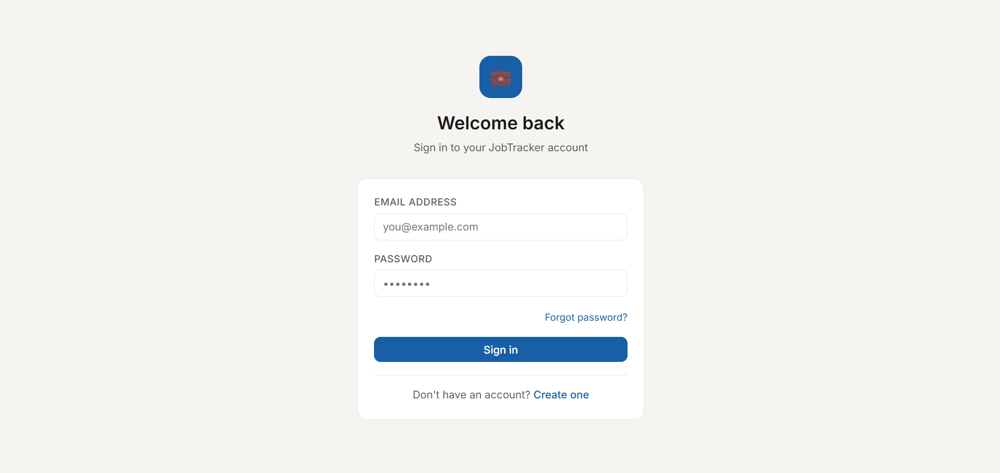
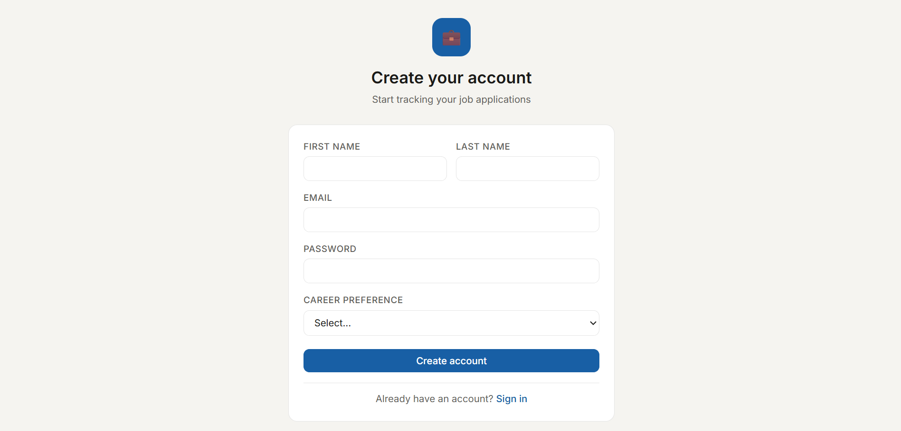
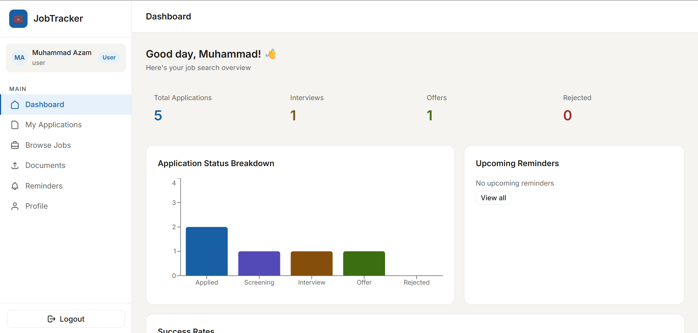
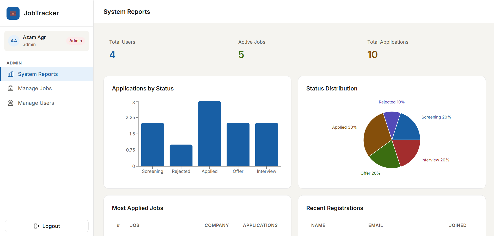

# Job Application Tracker

A full-stack web-based Job Application Tracker developed to help job seekers efficiently organize, manage, and monitor their job applications in one centralized platform.

---

# 📌 Project Overview

Searching and applying for jobs can become difficult when managing multiple applications across different companies. This application provides a structured system to track job applications, statuses, reminders, documents, and analytics.

The system helps users:
- Track application progress
- Manage resumes and cover letters
- Receive reminders and notifications
- Analyze job search performance

---

# 🚀 Features

## 🔐 User Management
- User Registration & Login
- JWT Authentication
- User Profile Management
- Secure Logout System

## 💼 Job Application Management
- Add New Job Applications
- Update/Delete Applications
- Track Status:
  - Applied
  - Screening
  - Interview
  - Offer
  - Rejected
- Save Company & Job Details
- Store Application Links & Contacts

## 📊 Dashboard & Reports
- User Dashboard
- Admin Dashboard
- Application Statistics
- Search & Filter Applications
- Visual Analytics

## ⏰ Reminders & Notifications
- Interview Reminders
- Follow-up Notifications
- In-App Alerts

## 📁 Document Management
- Upload Resume & Cover Letter
- Store Multiple Resume Versions
- Secure File Management

---

# 🛠️ Technologies Used

## Frontend
- React.js
- CSS
- Axios

## Backend
- Node.js
- Express.js

## Database
- MongoDB

## Authentication
- JWT (JSON Web Tokens)

## Notifications
- SendGrid
- Firebase Cloud Messaging

---

# 📂 Project Structure

```bash
job-application-tracker/
│
├── backend/
├── frontend/
├── README.md
└── package.json
```

---

# ⚙️ Installation & Setup

## Clone Repository

```bash
git clone https://github.com/azamagr/job-application-tracker.git
```

---

## Backend Setup

```bash
cd backend
npm install
npm start
```

---

## Frontend Setup

```bash
cd frontend
npm install
npm start
```

---

# 🌐 Application URLs

## Frontend
```bash
http://localhost:3000
```

## Backend
```bash
http://localhost:5000
```

---

# 📸 Screenshots

## 🔑 Login Page


---

## 📝 Register Page


---

## 👤 User Dashboard


---

## 🛠️ Admin Dashboard


---

## 📊 Job Management Page


---

# 📈 Future Improvements
- AI-based Job Recommendations
- Resume Analyzer
- Email Automation
- Mobile Application Version
- Real-time Notifications

---

# 👨‍💻 Author

Muhammad Azam

- GitHub: https://github.com/azamagr
- LinkedIn: https://linkedin.com/in/azamagr

---

# 📄 License

This project was developed for educational and internship purposes under the TEYZIX CORE Internship Program.